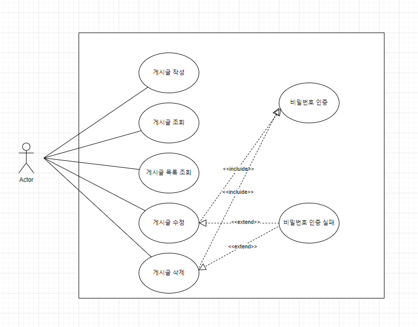
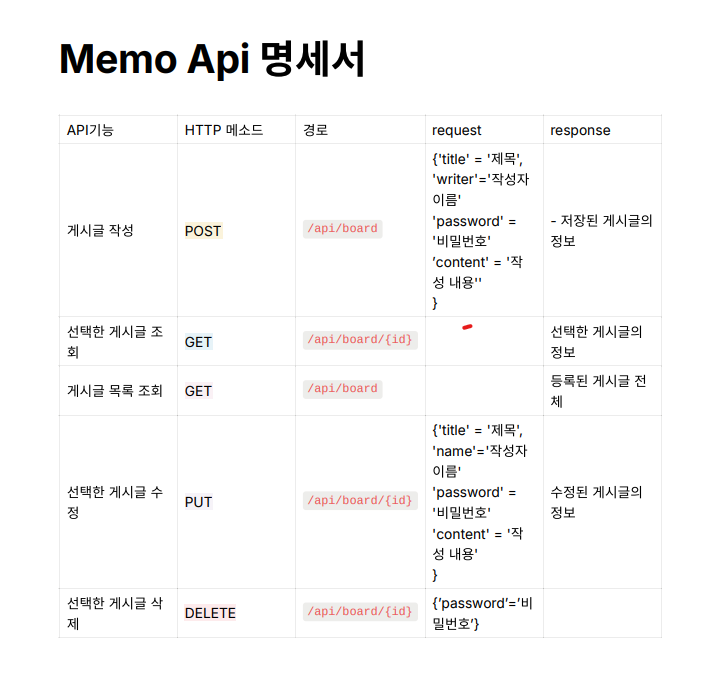
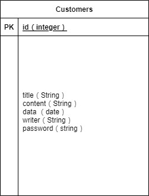

# 📋 게시판 서버

## 🎯 구현 목록
- [ ]  게시글 작성 기능
    - `제목`, `작성자명`, `비밀번호`, `작성 내용`, `작성일`을 저장할 수 있습니다.
    - 저장된 게시글의 정보를 반환 받아 확인할 수 있습니다.
        - 반환 받은 게시글의 정보에 `비밀번호`는 제외 되어있습니다.
- [ ]  선택한 게시글 조회 기능
    - 선택한 게시글의 정보를 조회할 수 있습니다.
        - 반환 받은 게시글의 정보에 `비밀번호`는 제외 되어있습니다.
- [ ]  게시글 목록 조회 기능
    - 등록된 게시글 전체를 조회할 수 있습니다.
        - 반환 받은 게시글의 정보에 `비밀번호`는 제외 되어있습니다.
    - 조회된 게시글 목록은 작성일 기준 내림차순으로 정렬 되어있습니다.
- [ ]  선택한 게시글 수정 기능
    - 선택한 게시글의 `제목`, `작성자명`, `작성 내용`을 수정할 수 있습니다.
        - 서버에 게시글 수정을 요청할 때 `비밀번호`를 함께 전달합니다.
        - 선택한 게시글의 `비밀번호`와 요청할 때 함께 보낸 `비밀번호`가 일치할 경우에만 수정이 가능합니다.
    - 수정된 게시글의 정보를 반환 받아 확인할 수 있습니다.
        - 반환 받은 게시글의 정보에 `비밀번호`는 제외 되어있습니다.
- [ ]  선택한 게시글 삭제 기능
    - 선택한 게시글을 삭제할 수 있습니다.
        - 서버에 게시글 삭제를 요청할 때 `비밀번호`를 함께 전달합니다.
        - 선택한 게시글의 `비밀번호`와 요청할 때 함께 보낸 `비밀번호`가 일치할 경우에만 삭제가 가능합니다.
      

  - [ ] 선택한 게시글 수정 및 삭제 요청 시 비밀번호가 일치하지 않을 경우 API 요청 실패(예외상황)에 대해 판단할 수 있는 Status Code, Error 메시지등의 정보를 반환합니다.

## 🔍 Use Case Diagram

## 📃 API 명세서

## 📁 ERD
